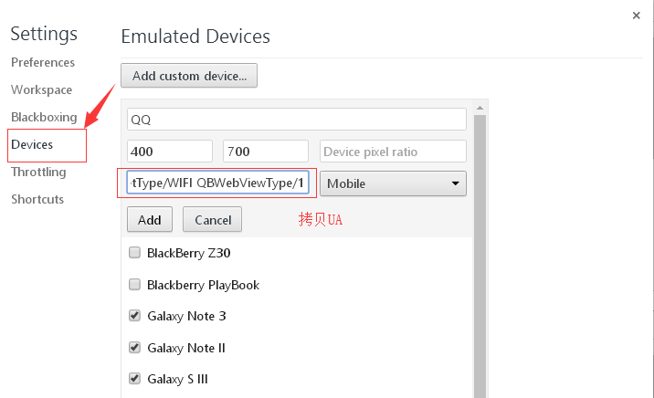
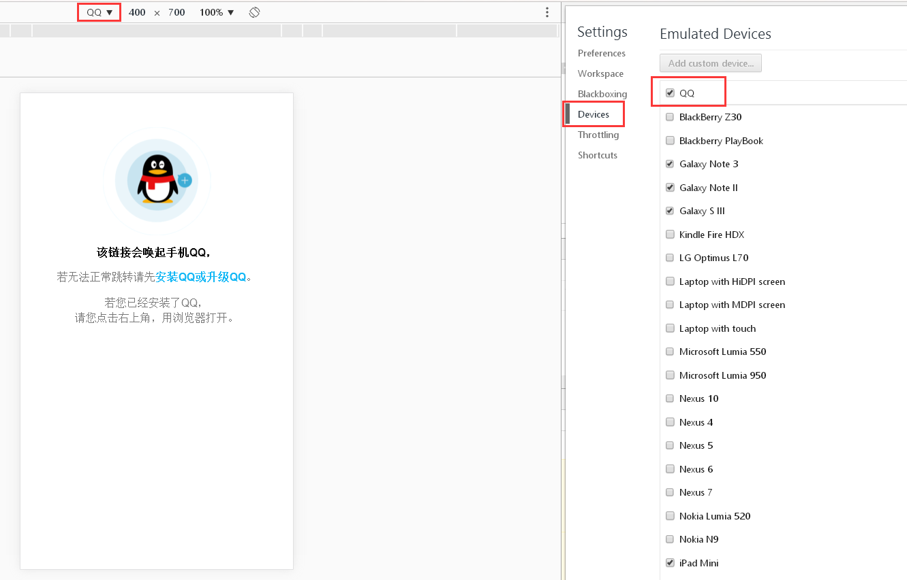
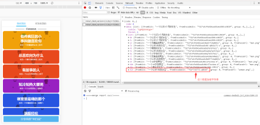

# tiqq

### qq坦白说解密

> 本教程只适合于获取20180607以前的坦白说，其余的暂无方法(历史坦白说，可以直接算出QQ)。腾讯将坦白说里面接收者的QQ号加密为18位数据库分布式自增主键，所以无法解密。

### 1、登录qq
https://im.qq.com/index.shtml
 
### 2、模拟UA
在F12右上角Settings-Devices-Add custorm device - 添加QQ浏览器的UA

```

ozilla/5.0 (iPhone; CPU iPhone OS 11_3 like Mac OS X) AppleWebKit/605.1.15 (KHTML, like Gecko) Mobile/15E5216a QQ/7.5.5.426 V1_IPH_SQ_7.5.5_1_APP_A Pixel/1080 Core/UIWebView Device/Apple(iPhone 8Plus) NetType/WIFI QBWebViewType/1

```


### 3、切换UA打开坦白说PC端
https://ti.qq.com/honest-say/my-received.html


### 4、获取JSON

```
{
	fromEncodeUin: "*S1*7iCF7i-qNK45"
	fromFaceUrl: "woman.png"
	fromGender: 1
	fromNick: "一个认识7年的女生"
	group: 0
	timestamp: 1524543195
	toNick: ""
	toUin: 394263788
	topicId: 36
	topicName: "吃海底捞加加辣"
}
```

### 5、跑程序计算

```
详见 tiqq/source/TiQQ/src/Main.java
```